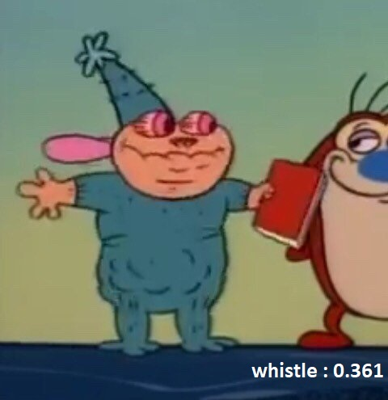
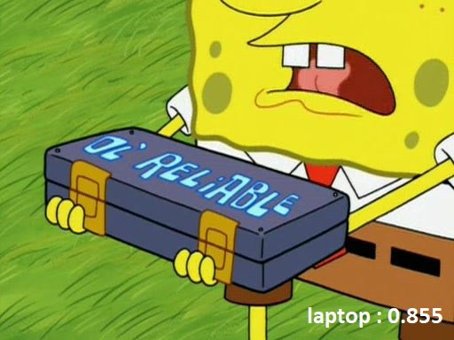
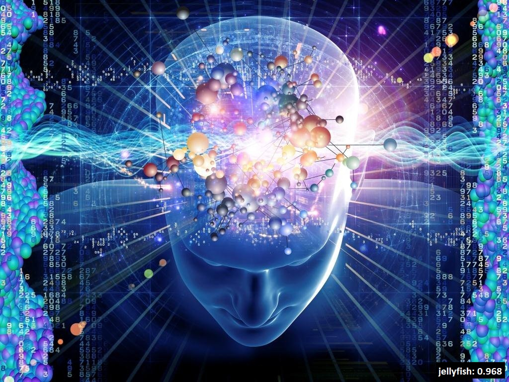

 
*Immagini erroneamente classificate* 

 

Di seguito viene proposta una selezione di immagini mal classificate dal modello, con la relativa etichetta e probabilità. Le immagini sono state selezionate sulla base del test da noi effettuato.
E' evidente che in caso di probabilità inferiore a 0.3, l'algoritmo ha difficoltà ad individuare l'oggetto effettivo presente nell'immagine. Quando tale soglia viene superata, l'algoritmo compie un errore giustificabile. Si tratta infatti di errori che anche l'occhio umano potrebbe ragionevolmente compiere. 

 

